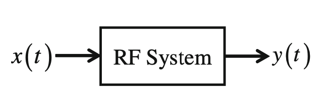

# RF システムのモデル

LLRF システムの設計と解析には、RF システムの（数学的）モデルが不可欠である。ここでいうモデルとは、RFシステムの出力と入力の間の（動的な）関係を伝達関数の形で記述したものです。伝達関数は、RF システムの動作と制限に関する洞察を与えます。例えば、RF ドライブ、ビーム負荷、および外部擾乱（電磁ノイズ、熱ドリフト、機械振動など）がある場合の RF システムの出力を、伝達関数を使用して予測することができます。また、モデルから得られる有用な情報として、ループ位相、ループゲイン、ループ遅延の安定限界値があり、これはRFコントローラのこれらの動作パラメータを決定するのに役立ちます。このように、RFシステムモデルは物理的な原理によって導き出されるため、動作パラメータの最適化やRFシステムの特性の特定にも利用することができます。

## 一般的な前提条件

本章で説明するモデルは，RF システムの構成要素の入出力関係（図 3.1 参照）に焦点を当て，それによって RF システムの制御と運用のための設計を可能にするものです．RF 空胴はモデル化される主要なコンポーネントとなります。空洞の入出力は、RF 駆動電力とビームに印加される RF 電界の包絡線によって表現される。空胴における高周波磁場の詳細な空間分布は、入出力関係に関係しないため、議論しない。本章では、RF 系は線形系としてモデル化し、非線形効果については7章で取り上げる。制御系の解析・設計では線形モデルの方が単純である。実際には、加速器の RF 系には非線形成分（RF アンプやクライストロンなど）が存在する。しかし、RFシステムの動作点付近の小さな範囲を考えるならば、線形モデルが良い近似となる。さらに、空洞の駆動項であるRF駆動電力やビームローディングは、モデル化においてノイズレスとして扱われる。Chap.6では、ノイズの多いRF駆動パワーとビームローディングが空洞フィールドに与える影響について議論する予定である。

<!--  -->

加速器 RF システムは，一般的に固定周波数またはゆっくりと時間的に変化する周波数で動作する狭帯域のものである。同期システムから提供されるRF基準信号は、ローカルオシレータ（LO）、クロック、RF動作周波数など、RFステーション内の様々な周波数のソースとして使用される。ここでは、RF基準信号の周波数をRF基準周波数と定義し、それを表すのに$\omega_{ref}$を使用する。デフォルトでは、RF局の実際の動作周波数であるRF動作周波数$\omega_{RF}$は、$\omega_{ref}$に等しいと仮定します。もう 1 つの概念は、キャリア周波数 $\omega_{c}$で、これは柔軟に選択され、多くの場合 $\omega_c = \omega_{RF}$ を選択します。異なるRF信号の場合、ωcはそれらの共通項を表し、RF成分の入出力関係を記述する際には省略される。$\omega_c = \omega_{RF}$ とすると、RFシステムのモデルをその入出力の包絡線から求めることができる。

$\omega_{RF}$ が定数の場合、$\omega_c$ は$\omega_{RF}$と同じように定義するのが便利ですが、時間的に変化する$\omega_{RF}$ の場合、$\omega_c$ を2通りの方法で扱うことができます。

1. $\omega_c$ を変化させて $\omega_{RF}$ に追従させることができます。この方法は、RFシステムモデルにとって$\omega_{RF}$の変化を透過的にし、したがって、RF信号のエンベロープ（すなわちベースバンド信号）のみを扱うことになります。
2. 固定の $\omega_c$ を選択してもよい。これにより、RFシステムモデルが扱う信号には、時変位相 $\phi (t) = [\omega_{RF} (t)\omega_{c}]t + \phi_{0i}$ ($\phi_{0i}$ は各信号の定数)が発生する。この方法を用いる場合、RF成分の正しい入出力関係を得るためには、すべてのRF信号の位相の時間変化項 $[\omega_{RF}(t) - \omega_{c}]t$を省略する必要がある。

上記の最初のケースは、RF信号のスペクトルを直接DC付近にシフトさせ、2番目のケースは中間周波数（IF）付近にシフトさせるものです。本書では、RFシステムのモデリングとコントローラ設計を簡単にするために、常に $\omega_c = \omega_{RF}$ を仮定します。

もうひとつの仮定は、加速器の RF システムの帯域幅が RF 動作周波数よりもはるかに小さいという事実から来ている（$\omega_{1/2} \ll \omega_{RF}$ 、ここで $\omega_{1/2}$ は全帯域幅の半分）。これは、RF 信号のエンベロープが RF 周波数よりはるかに遅く変化することを意味する。したがって、RF信号の包絡線は、RF周波数の数周期内でほぼ一定として扱うことができる。

## RF モデリング方法

図3.1 のRFコンポーネントの入出力関係は，*時間領域*の関数 $g(t) : x(t) \rightarrow y(t)$ として記述することができる。ここで $g$ は静的システムではスカラー（$x$ または $y$ がベクトルの場合は行列）、動的システムでは微分方程式（またはその群）である。ここで X(s) と Y(s) は時間領域の入力信号と出力信号のラプラス変換です。XðsÞ 1⁄4 LfxðtÞg, YðsÞ 1⁄4 LfyðtÞg . 演算子 Lfg はラプラス変換を表す。ここで、t 0 のとき x(t) 1⁄4 0、y(t) 1⁄4 0 と仮定した。変数 s は s ⋈σ + jω として定義される複素周波数である。ここでは、信号のラプラス変換と伝達関数の集まりを周波数領域（s領域）という言葉で表すことにする。sの複素平面をs平面と呼ぶ。ラプラス変換は線形システムをモデル化する強力なツールであり、古典的な制御理論の基礎を形成している(Dorf and Bishop 2010)。システムの入力と出力が実数値を持つ時間領域のスカラーである実信号の場合、システムの伝達関数は実数値の係数を持ち、その周波数特性は正と負の周波数に対して対称である。

これまで述べてきたように，RF コンポーネントの入出力信号には同じ搬送波周波数項が含まれており，入出力関係には有用な情報が得られない。そこで、入力信号と出力信号の包絡線から得られる伝達関数のみを考慮することにします。そのために、搬送波周波数項を取り除き、RF信号を位相（複素信号）として記述する。位相とRF信号の変換は、LLRFシステムにおけるRF信号の検出・作動処理とよく一致する。入出力の位相子にラプラス変換を適用すると、複素数値の係数を持ち、非対称な周波数応答を持つ伝達関数が得られる（Novotny and Wouterse 1976; Martin 2004; Harnefors 2007; Brandt 2007; Troeng 2019）。位相から派生したこのような伝達関数には、RFシステムモデルの次数を2から1に減らすことができるという第一の利点があります。後に、LLRFシステムの解析と設計を大幅に簡略化できることがわかります。

## RF信号の説明
搬送波周波数ωc、時間的に変化する振幅x0（t）、時間的に変化する位相φ（t）を持つRF信号は、時間領域で次のように記述することができる。

www.DeepL.com/Translator（無料版）で翻訳しました。

# Theory of RF Cavity

## Power dissipation
$$
P_{diss} = \frac{1}{2} \cdot \frac{V_{cav}^2}{R} = \frac{V_{cav}^2}{R_{sh}} 
$$
### Shut impedance
$$
R = \frac{1}{2}\cdot R_{sh}
$$

## Input Coupler representation as an ideal transformer

$$
V_2 = n \cdot V_1 , \quad I_2 = \frac{1}{n} \cdot I_1
$$
したがって、
$$
Z_2 = n^2 \cdot Z_1
$$
## Coupling-factor $\beta$
$$
\beta = \frac{R}{Z_{ext}} = \frac{R}{N^2Z_0}
$$

## Quality factor Q

$$
Q = 2\pi \frac{stored\; energy\; in\; cavity}{dissipated \; energy\; per\; cycle} = \frac{\omega_0 W}{P_{diss}}
$$
